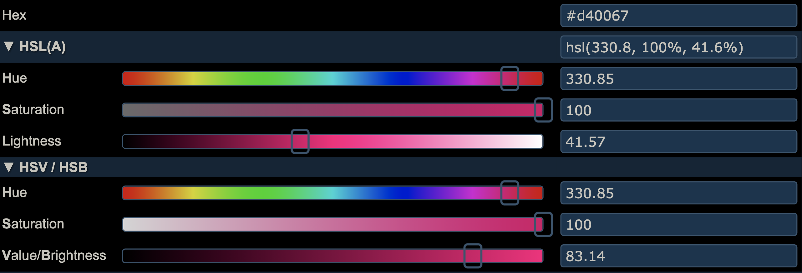

```{r setup, include=FALSE}
knitr::opts_chunk$set(echo = TRUE)
```

```{r metathis, message=FALSE, warning=FALSE, include=FALSE}
library(metathis)

meta() %>%
  meta_name("github-repo" = "ellakaye/ellakaye-distill") %>%
  meta_viewport() %>%
  meta_social(
    title = "TITLE", # adding title here removes "ELLA KAYE: " from the front
    image = "https://ellakaye.rbind.io/posts/FULL_PATH_TO_IMAGE.png", 
    image_alt = "ALT TEXT FOR IMAGE",
    og_type = "website",
    og_author = c("Ella Kaye"),
    twitter_card_type = "summary_large_image", # can also be summary
  )
```

## TL;DR

The [{distill}](https://rstudio.github.io/distill/) package for R can be used to build easy-to-maintain websites written only in R markdown. It's the package on which this site is built.^[For more on resources and inspirations for setting up a {distill} website, see my previous post, [Welcome to my {distill} website](https://ellakaye.rbind.io/posts/2021-05-08-welcome-to-my-distill-website/).]

**Summary of the code chunk, like in Alison's blogdown post, or call to {distilltools} function**

**Code chunk to demonstrate the palette**

Read on for why and how this function was built, its somewhat clunky name and its inclusion in the [{distilltools}](https://github.com/EllaKaye/distilltools) package, as well as considerations about colour choices, in respect to both colour theory and accessibility.

## But first, the default

### In praise of the default

Before I get into how to create a custom syntax highlighting scheme, I want to take a minute to admire the default. The authors of {distill}, in particular [Alison Hill](https://alison.rbind.io), have thought and worked hard to ensure that {distill} provides a good user experience, both for the site's author AND for those reading it. One of the key considerations for the latter is a default syntax highlighting scheme with colours that are optimised for accessibility and colour contrast. I say more about what that means below **SECTION LINK**. Also, it appears that the colours in the scheme work well together, and overall, on many {distill} websites where I've seen the scheme used, I think it looks really good! For a great example of the default in action, check out this [code-chunk-heavy post](https://themockup.blog/posts/2021-03-07-creating-a-custom-gt-function-for-aligning-first-row-text-and-testing-it-with-testthat/) by [Tom Mock](https://twitter.com/thomas_mock).

### So, why change?
When I used the default syntax highlighting theme on my site I found, to my eye, that the red used for numeric variables clashed with the bright pink I've used in my logo and elsewhere throughout the site. So, I decided to tweak the default theme swapping the red for my pink and, to match it, more vibrant versions of the remaining colours.

### Distill/pandoc documentation
My first task was to find out whether this was possible, and if, so, how. Thankfully, the {distill} documentation contains a section on [syntax highlighting](https://rstudio.github.io/distill/#syntax-highlighting), showing that there is an option to give `distill_article` a path to a custom `.theme` file. The [linked pandoc documentation on syntax highlighting](https://pandoc.org/MANUAL.html#syntax-highlighting) demonstrates how to use pandoc in the command line to save a personal version of the `pygments` highlighting theme, stating that can then be edited to create a custom theme. 

### Finding and saving the default
Once I had a general strategy of copying and editing an existing `.theme` file, my next task was to find the `.theme` file for the default used in {distill], because that's what I'd decided to take as my starting point.

I cloned the [distill repo from GitHub](https://github.com/rstudio/distill) and opened it in RStudio^[From RStudio, go to 'File' in the menu bar, then 'New Project...'. Chose 'Version Control', then 'Git', then enter `https://github.com/rstudio/distill.git` as the 'Repository URL:' and click 'Create Project']. From there I began my detective work with one of my favourite RStudio features, 'Find in Files' (⇧ + ⌘ + <kbd>f</kbd> on a Mac), which searches across all files in a project. I searched for "highlight" and followed various trails until I discovered that the default is called `arrow.theme` and is stored in `inst/rmarkdown/templates/distill_article/resources/`. Thankfully, because it's in the `inst` folder, the file is accessible to users who have the {distill} package installed. In the RStudio project for my website, I created a new script, `syntax_highlighting.R`, in the `R` folder I have in my root directory, then ran the following to save a copy of `arrow.theme` into my website's root directory:

```{r eval = FALSE}
arrow_theme_path <- system.file(
  "rmarkdown/templates/distill_article/resources/arrow.theme", 
  package = "distill"
)

file.copy(arrow_theme_path, "arrow.theme")
```

Once I had run that once, I commented out the lines. I don't want any future changes in `arrow.theme` in {distill} to break what I do next.

### Closer inspection of the default

From there, I could open up my copy `arrow.theme` file, and manually inspected it. I use a great Mac app for building colour palettes, [ColorSlurp](https://colorslurp.com). The basic version is free, though the pro version has great features for testing accessibility - more on that below. I don't have experience of colour apps on other operating systems, but a quick search for ColorSlurp alternatives suggest there are [a bunch to pick from](https://alternativeto.net/software/colorslurp/)]. I set up a new palette in ColorSlurp and, for each hex colour code I encountered, I saved it there.

There are 29 types of `text-styles` in the theme, of which:
- 8 are assigned a grey, things like `Comment` and `Documentation`
- 1 is off-black, `Variable`
- 3 are blue, `Other`, `ControlFlow` and `Keyword`
- 4 are green, corresponding to various types of string
- 1 is purple, `Function`
- 7 are red, a mix of numeric (e.g. `BaseN`, `Float`) and things like `Alert` and `Error`
- 1 is a brown, for `Constant`
- 4 types are not assigned a colour - they are left as `null`

I was happy to stick with the groupings, grey and `null` in the default, so now I knew I had to pick five colours for my theme.

## Building my own palette 

### A brief primer on colour theory

Colour theory determines which colours 'look good' together, based on their relative position around a colour wheel, somewhat analogously, I think, to how certain musical intervals sound more pleasing/harmonious than others, depending on the ratio of their frequencies. There are various different types of colour palettes that are in colour harmony, such as complementary (comprised of colours opposite each other on the wheel), analagous (three colours side by side) and triadic (three colours evenly spaced around). 

**INSERT IMAGE HERE?**

Another aspect of colour relates to colour spaces, and different ways that colours can be defined. The best known, at least in the context of designing for the web, is RGB (**R**eg **G**reen **B**lue), which defines a colour by how much of each of those three primary colours it contains, in a range of 0-255.

More intuitive, however, for adjusting colours, is defining them by SB (**H**ue, **S**aturation, **B**rightness), also known as HSV (**H**ue, **S**aturation, **V**alue). Similar to HSB is HSL (**H**ue, **S**aturation, **L**ightness/**L**uminance/**L**uminosity). It is also known, particularly in R, through the [colorspace](https://colorspace.r-forge.r-project.org/articles/colorspace.html) package, as HCL (**H**ue, **C**hroma, **L**uminance). Even more confusingly, the saturation component is different in HSB and HSL!

In HSB, the hue represents the colour type and is a number measured between 0 and 360°; it's where you are on the colour wheel. Saturation describes the intensity or richness of the hue, measured between 0 and 100%. 100% is the richest version of the colour and 0% is a shade of grey. Brightness measures, you guessed it, the brightness of the colour. Again, it ranges from 0 to 100%, with 0% being black and 100% being a very bright colour (here, black is not the opposite of white). Here's a [excellent article on the HSB system](https://learnui.design/blog/the-hsb-color-system-practicioners-primer.html), which also explains how it differs from HSL. And since a picture here is worth very many words, see Figure \@ref(fig:hsl-hsb-sliders) for HSL and HSB sliders for my pink.

```{r hsl-hsb-sliders, echo = FALSE, fig.cap="HSL and HSB sliders for the pink used throughout this site. Image is a screenshot from [http://colorizer.org](http://colorizer.org). ADD ALT TEXT"}

```

### Building a palette using colour theory

There are [lots of online palette creators](https://www.elegantthemes.com/blog/resources/color-palette-generators), which will produce palettes based on various colour theory principles, given a starting colour. Personally, I think that the [canva colour wheel](https://www.canva.com/colors/color-wheel/) is a great place to start (probably because that's the one I started with!) It's pretty simple, but nicely designed and easy to use, and the page explains the basics of colour theory too.

The more I played around with the canva colour wheel, though, the clearer it was that it didn't quite meet my needs. In particular, I needed five colours, and here we only have options for palettes of up to four. 
On pretty much the other end of the scale to the canva colour wheel, I found [colorizer.org](http://colorizer.org). It lacks in pleasing design and ease of use, plus it's a bit buggy. It took me a while to figure out, so I'll share what I learnt. The easiest way to get started is to enter the hex value of your main colour into the hex box, five boxes down on the right. Then scroll down past the sliders (more on those in just a moment), and you get to a bunch of different harmonious palettes, including, very helpfully for our needs, one that contains twelve different colours. To get the hex codes for the colours in those palettes, though, you have to drag and drop them into the squares to the right of the sliders (that's the part that's a bit buggy), and then read off the hex code from the hex box. A bit fiddly, but worth it. Plus, scroll down further, and there's a more technical explanation of different colour spaces. I then copied those hex codes into ColorSlurp, which has an easier user interface and a contrast checker, which becomes important in the next step of the process.

### Adapting for web accessibility

- <https://www.w3.org/WAI/standards-guidelines/wcag/>
- <https://color.a11y.com>
- <https://www.a11yproject.com>
- Silvia Canelón

- Keep hue and saturation, decrease brightness


### Checking for colourblindness

- <https://njt-monash-colour.netlify.app/#1>
- <https://www.njtierney.com/post/2020/10/15/assess-colour/>

```{r}
ek_highlight_colours <- c("#B55D00", "#008745", "#0067D4", "#6D00D4", "#D40067")
```

```{r}
library(prismatic)
check_color_blindness(ek_highlight_colours)
```

## Putting it all together
### Modifying `arrow.theme`

With all the pieces in place, it's now just a case of swapping out the default colour codes for our own choices

- show code (base and tidyverse)

- can modify further by hand

- Quirk of background color, how to modify CSS instead

### Using the theme

Issues with `_site.yml` vs YAML in individual distill articles (and link to open issue).

- `_site.yml` vs `.Rmd`

## Wrapping in a {distilltools} function

- NEED TO WRITE THE FUNCTION AND PUT IT IN DISTILLTOOLS!
- `modify_default_highlighting_theme()`
- New package from R Markdown team, so this one likely to be depreciated
- Clunky function name on purpose
- Still need to follow the steps in the previous section to use the theme.
