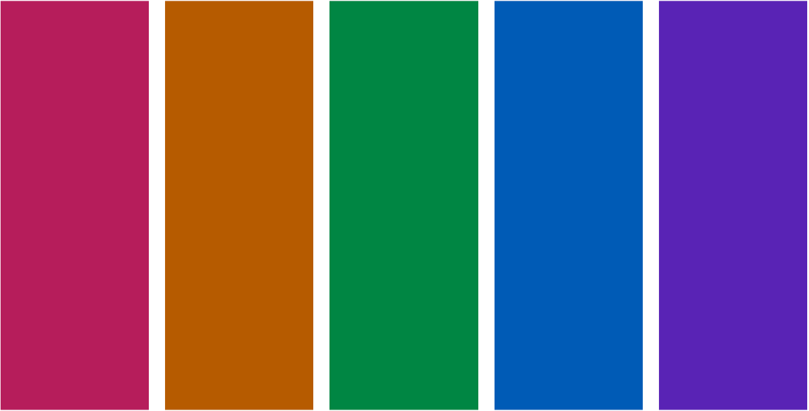

```{r setup, include=FALSE}
knitr::opts_chunk$set(
  echo = TRUE,
  R.options = list(width = 60)
)
```

```{r metathis, message=FALSE, warning=FALSE, include=FALSE}
library(metathis)

meta() %>%
  meta_name("github-repo" = "ellakaye/ellakaye-distill") %>%
  meta_viewport() %>%
  meta_social(
    title = "TITLE", # adding title here removes "ELLA KAYE: " from the front
    image = "https://ellakaye.rbind.io/posts/FULL_PATH_TO_IMAGE.png", 
    image_alt = "ALT TEXT FOR IMAGE",
    og_type = "website",
    og_author = c("Ella Kaye"),
    twitter_card_type = "summary_large_image", # can also be summary
  )
```

## TL;DR

The [{distill}](https://rstudio.github.io/distill/) package for R can be used to build easy-to-maintain websites written only in R markdown. It's the package on which this site is built.^[For more on resources and inspirations for setting up a {distill} website, see my previous post, [Welcome to my {distill} website](https://ellakaye.rbind.io/posts/2021-05-08-welcome-to-my-distill-website/).]

I wrote a function to modify the default syntax highlighting theme, and put it in the [{distilltools}](https://ellakaye.github.io/distilltools) package. 

Here's the function in action, to get the theme used on this site:

```{r eval = FALSE}
library(distilltools)
modify_default_highlighting(
  name = "ek_syntax_highlighting",
  numbers = "#B6005B",
  strings = "#008643",
  functions = "#005BB6",
  control = "#5A00B5",
  constant = "#B65B00"
)
```

And here's the theme in action:

```{r eval = FALSE}
library(dplyr)
library(palmerpenguins)

penguins %>%
  mutate(
    long_flipper = case_when(
      species == "Adelie" & flipper_length_mm > 195 ~ TRUE,
      species == "Chinstrap" & flipper_length_mm > 200 ~ TRUE,
      species == "Gentoo" & flipper_length_mm > 225 ~ TRUE,
      TRUE ~ FALSE
    )
  )
```

This is the first in a series of two posts on implementing a custom syntax highlighting theme for a website or blog built with {distill}. Read on here for why and how this function was built, its somewhat clunky name and its inclusion in the [{distilltools}](https://github.com/EllaKaye/distilltools) package. Take a look at Part 2, **FULL NAME AND LINK**, for a deep dive into considerations about colour choices when building a syntax highlighting scheme, in respect to both colour theory and accessibility.

## But first, the default

### In praise of the default

Before I delve into how to create a custom syntax highlighting scheme, I want to take a minute to admire the default. The authors of {distill}, in particular [Alison Hill](https://alison.rbind.io), have thought and worked hard to ensure that {distill} provides a good user experience, both for the site's author AND for those reading it. One of the key considerations for the latter is a default syntax highlighting scheme with colours that are optimised for accessibility and colour contrast. I say more about what that means below **SECTION LINK**. Also, it appears that the colours in the scheme work well together, and overall, on many {distill} websites where I've seen the scheme used, I think it looks really good! For a great example of the default in action, check out this [code-chunk-heavy post](https://themockup.blog/posts/2021-03-07-creating-a-custom-gt-function-for-aligning-first-row-text-and-testing-it-with-testthat/) by [Tom Mock](https://twitter.com/thomas_mock).

### So, why change?

```{r echo = FALSE}
library(htmltools)
library(coloratio)
bg_col <- function(bg_col, text = NULL, text_col = NULL) {
  
  if(is.null(text)) text <- bg_col
  
  if(is.null(text_col)) text_col <- coloratio::cr_choose_bw(bg_col)
  
  style <- paste0("background-color: ", bg_col, "; color: ", text_col, "; padding:3px")
  
  htmltools::span(style = style, text)
}
```


When I used the default syntax highlighting theme on my site I found, to my eye, that the red used for numeric variables clashed with the `r bg_col("#D4006A", text = "bright pink")` (closest colour name, the rather fun "razzmatazz") I've used in my logo and elsewhere throughout the site. So, I decided to tweak the default theme swapping the red for my pink and, to match it, more vibrant versions of the remaining colours.

### Distill/pandoc documentation
My first task was to find out whether this was possible, and if, so, how. Thankfully, the {distill} documentation contains a section on [syntax highlighting](https://rstudio.github.io/distill/#syntax-highlighting), showing that there is an option to give `distill_article` a path to a custom `.theme` file. The [linked pandoc documentation on syntax highlighting](https://pandoc.org/MANUAL.html#syntax-highlighting) demonstrates how to use pandoc in the command line to save a personal version of the `pygments` highlighting theme, stating that can then be edited to create a custom theme. 

### Finding and saving the default
Once I had a general strategy of copying and editing an existing `.theme` file, my next task was to find the `.theme` file for the default used in {distill}, because that's what I'd decided to take as my starting point.

I cloned the [distill repo from GitHub](https://github.com/rstudio/distill) and opened it in RStudio^[From RStudio, go to 'File' in the menu bar, then 'New Project...'. Chose 'Version Control', then 'Git', then enter `https://github.com/rstudio/distill.git` as the 'Repository URL:' and click 'Create Project']. From there I began my detective work with one of my favourite RStudio features, 'Find in Files' (⇧ + ⌘ + <kbd>f</kbd> on a Mac), which searches across all files in a project. I searched for "highlight" and followed various trails until I discovered that the default is called `arrow.theme` and is stored in `inst/rmarkdown/templates/distill_article/resources/`. Thankfully, because it's in the `inst` folder, the file is accessible to users who have the {distill} package installed. In the RStudio project for my website, I created a new script, `syntax_highlighting.R`, in the `R` folder I have in my root directory, then ran the following to save a copy of `arrow.theme` into my website's root directory:

```{r eval = FALSE}
arrow_theme_path <- system.file(
  "rmarkdown/templates/distill_article/resources/arrow.theme", 
  package = "distill"
)

file.copy(arrow_theme_path, "arrow.theme")
```

Once I had run that once, I commented out the lines. I don't want any future changes in `arrow.theme` in {distill} to break what I do next.

### Closer inspection of the default

From there, I could open up my copy of the `arrow.theme` file, and manually inspected it. I use a great Mac app for building colour palettes, [ColorSlurp](https://colorslurp.com)^[I don't have experience of colour apps on other operating systems, but a quick search for ColorSlurp alternatives suggest there are [a bunch to pick from](https://alternativeto.net/software/colorslurp/).]. The basic version is free, though the pro version has great features for testing accessibility - more on that below. I set up a new palette in ColorSlurp and, for each hex colour code I encountered, I saved it there.

There are 29 types of `text-styles` in the theme, of which:

- 8 are assigned a grey, `r bg_col("#5E5E5E")`, things like `Comment` and `Documentation`
- 1 is off-black, `r bg_col("#111111")`, `Variable`
- 3 are blue, `r bg_col("#007BA5")`, `Other`, `ControlFlow` and `Keyword`
- 4 are green, `r bg_col("#20794D")`, corresponding to various types of string
- 1 is purple, `r bg_col("#4758AB")`, `Function`
- 7 are red, `r bg_col("#AD0000")`, a mix of numeric (e.g. `BaseN`, `Float`) and things like `Alert` and `Error`
- 1 is a brown, `r bg_col("#8F5902")`, for `Constant`
- 4 types are not assigned a colour - they are left as `null`

I was happy to stick with the groupings, grey, off-black and `null` in the default, so now I knew I had to pick five colours for my theme.

## Building my own palette 

I had four criteria for building a colour palette to use for my syntax highlighting theme:

- It be based around <span style="color:#D4006A">the pink</span> that I use in my logo and elsewhere throughout this site
- It uses colour theory to pick colours that all look appealing together
- It meets [WCAG web accessibility guidelines](https://www.w3.org/WAI/standards-guidelines/wcag/), by ensuring sufficient colour contrast between the colours in the theme and this site's background colour (white)
- The colours in the palette are colourblind-friendly, i.e. still distinguishable to people with various difference types of colourblindness.

I was originally going to write up how I went about building such a palette, both in terms of the thought process and tools used, as part of this post, but it was getting a little long^[As part of the process of writing the post, I learnt much more about colour theory, and alternatives to the approach that I had originally taken, and I wanted to share it all!], so I've spun it out into a separate post: ADD LINK.

At the end of the process, the palette for my syntax highlighting scheme is as in Figure \@ref(fig:ek-syntax-highlighting-palette).

```{r ek-syntax-highlighting-palette, echo = FALSE, fig.cap="The color palette used for syntax highlighting throughout this site."}

```


## Putting it all together
### Modifying `arrow.theme`

With all the pieces in place, it's now just a case of swapping out the default colour codes for our own choices. Although manual editing of the `arrow.theme` file we now have in our directory is possible, to aid reproducibility, we're going to edit it using R code instead, by reading in the file, substituting the hex codes, then saving the resulting theme into a new `.theme` file. Below are two approaches, one using base R, the other in the tidyverse.

```{r eval = FALSE}

# read in the default theme
theme <- readLines("arrow.theme")

# base R approach
theme <- gsub("#AD0000", "#BD005B", theme) # red -> pink
theme <- gsub("#8f5902", "#B65D00", theme) # brown -> orange (note lower case!)
theme <- gsub("#007BA5", "#5A00B5", theme) # blue -> purple
theme <- gsub("#20794D", "#008643", theme) # green -> green
theme <- gsub("#4758AB", "#005BB6", theme) # purple -> blue

# alternatively, tidyverse approach
library(stringr)
library(magrittr)

theme <- readLines("arrow.theme") %>%
   str_replace_all("#AD0000", "#BD005B") %>% # red -> pink
   str_replace_all("#8f5902", "#B65D00") %>% # brown -> brown (note lower case!)
   str_replace_all("#007BA5", "#5A00B5") %>% # blue -> purple
   str_replace_all("#20794D", "#008643") %>% # green -> green
   str_replace_all("#4758AB", "#005BB6")     # purple -> blue

# save new theme
writeLines(theme, "ek_syntax_highlighting.theme")
```

I now have the file `ek_syntax_highlighting.theme` in my root directory, with my colour choices.

It is, of course, possible to modify it further, either manually or by making further substutions in the code above. There is a quirk, though. If I swap one of the default hex codes for my own colour choice, that implements just fine, but if I swap any of the `null`s for a colour, that doesn't show up when I apply the theme. 

### Using the theme

Issues with `_site.yml` vs YAML in individual distill articles (and link to open issue).

- `_site.yml` vs `.Rmd`

## Wrapping in a {distilltools} function

- NEED TO WRITE THE FUNCTION AND PUT IT IN DISTILLTOOLS!
- `modify_default_highlighting_theme()`
- New package from R Markdown team, so this one likely to be depreciated
- Clunky function name on purpose
- Still need to follow the steps in the previous section to use the theme.
