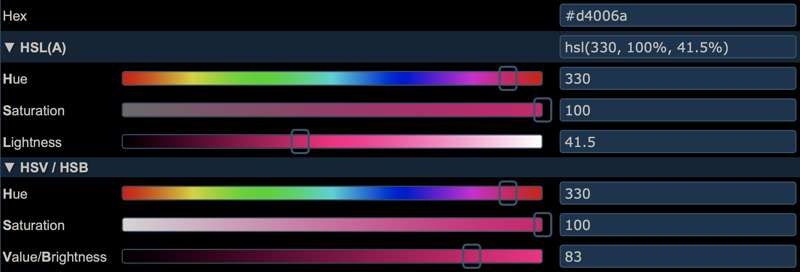
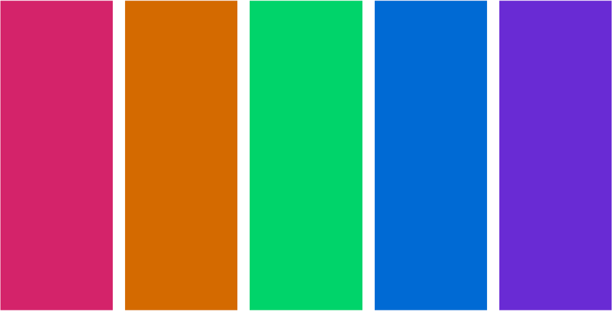
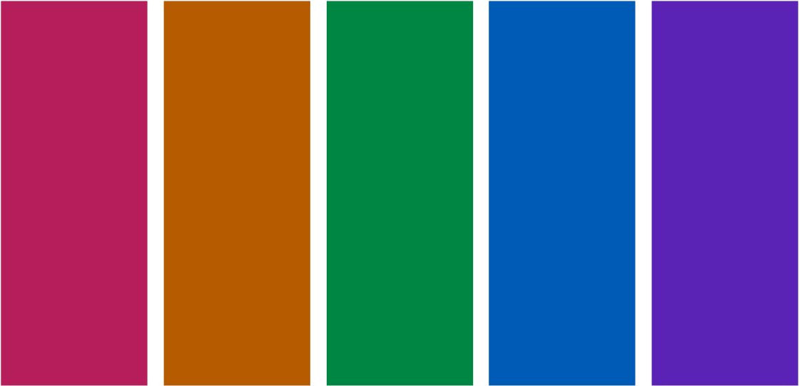

```{r setup, include=FALSE}
knitr::opts_chunk$set(
  echo = TRUE,
  R.options = list(width = 60)
)
```

```{r metathis, message=FALSE, warning=FALSE, include=FALSE}
library(metathis)

meta() %>%
  meta_name("github-repo" = "ellakaye/ellakaye-distill") %>%
  meta_viewport() %>%
  meta_social(
    title = "TITLE", # adding title here removes "ELLA KAYE: " from the front
    image = "https://ellakaye.rbind.io/posts/FULL_PATH_TO_IMAGE.png", 
    image_alt = "ALT TEXT FOR IMAGE",
    og_type = "website",
    og_author = c("Ella Kaye"),
    twitter_card_type = "summary_large_image", # can also be summary
  )
```

## TL;DR

The [{distill}](https://rstudio.github.io/distill/) package for R can be used to build easy-to-maintain websites written only in R markdown. It's the package on which this site is built.^[For more on resources and inspirations for setting up a {distill} website, see my previous post, [Welcome to my {distill} website](https://ellakaye.rbind.io/posts/2021-05-08-welcome-to-my-distill-website/).]

**Summary of the code chunk, like in Alison's blogdown post, or call to {distilltools} function**

**Code chunk to demonstrate the palette**

Read on for why and how this function was built, its somewhat clunky name and its inclusion in the [{distilltools}](https://github.com/EllaKaye/distilltools) package, as well as considerations about colour choices, in respect to both colour theory and accessibility.

## But first, the default

### In praise of the default

Before I delve into how to create a custom syntax highlighting scheme, I want to take a minute to admire the default. The authors of {distill}, in particular [Alison Hill](https://alison.rbind.io), have thought and worked hard to ensure that {distill} provides a good user experience, both for the site's author AND for those reading it. One of the key considerations for the latter is a default syntax highlighting scheme with colours that are optimised for accessibility and colour contrast. I say more about what that means below **SECTION LINK**. Also, it appears that the colours in the scheme work well together, and overall, on many {distill} websites where I've seen the scheme used, I think it looks really good! For a great example of the default in action, check out this [code-chunk-heavy post](https://themockup.blog/posts/2021-03-07-creating-a-custom-gt-function-for-aligning-first-row-text-and-testing-it-with-testthat/) by [Tom Mock](https://twitter.com/thomas_mock).

### So, why change?
When I used the default syntax highlighting theme on my site I found, to my eye, that the red used for numeric variables clashed with the bright pink I've used in my logo and elsewhere throughout the site. So, I decided to tweak the default theme swapping the red for my pink and, to match it, more vibrant versions of the remaining colours.

### Distill/pandoc documentation
My first task was to find out whether this was possible, and if, so, how. Thankfully, the {distill} documentation contains a section on [syntax highlighting](https://rstudio.github.io/distill/#syntax-highlighting), showing that there is an option to give `distill_article` a path to a custom `.theme` file. The [linked pandoc documentation on syntax highlighting](https://pandoc.org/MANUAL.html#syntax-highlighting) demonstrates how to use pandoc in the command line to save a personal version of the `pygments` highlighting theme, stating that can then be edited to create a custom theme. 

### Finding and saving the default
Once I had a general strategy of copying and editing an existing `.theme` file, my next task was to find the `.theme` file for the default used in {distill], because that's what I'd decided to take as my starting point.

I cloned the [distill repo from GitHub](https://github.com/rstudio/distill) and opened it in RStudio^[From RStudio, go to 'File' in the menu bar, then 'New Project...'. Chose 'Version Control', then 'Git', then enter `https://github.com/rstudio/distill.git` as the 'Repository URL:' and click 'Create Project']. From there I began my detective work with one of my favourite RStudio features, 'Find in Files' (⇧ + ⌘ + <kbd>f</kbd> on a Mac), which searches across all files in a project. I searched for "highlight" and followed various trails until I discovered that the default is called `arrow.theme` and is stored in `inst/rmarkdown/templates/distill_article/resources/`. Thankfully, because it's in the `inst` folder, the file is accessible to users who have the {distill} package installed. In the RStudio project for my website, I created a new script, `syntax_highlighting.R`, in the `R` folder I have in my root directory, then ran the following to save a copy of `arrow.theme` into my website's root directory:

```{r eval = FALSE}
arrow_theme_path <- system.file(
  "rmarkdown/templates/distill_article/resources/arrow.theme", 
  package = "distill"
)

file.copy(arrow_theme_path, "arrow.theme")
```

Once I had run that once, I commented out the lines. I don't want any future changes in `arrow.theme` in {distill} to break what I do next.

### Closer inspection of the default

From there, I could open up my copy `arrow.theme` file, and manually inspected it. I use a great Mac app for building colour palettes, [ColorSlurp](https://colorslurp.com)^[I don't have experience of colour apps on other operating systems, but a quick search for ColorSlurp alternatives suggest there are [a bunch to pick from](https://alternativeto.net/software/colorslurp/)].]. The basic version is free, though the pro version has great features for testing accessibility - more on that below. I set up a new palette in ColorSlurp and, for each hex colour code I encountered, I saved it there.

```{r echo = FALSE}
library(htmltools)
bg_col <- function(col, text = NULL) {
  
  if(is.null(text)) text <- col
  
  style <- paste0("background-color: ", col, "; color: white; padding:3px")
  
  htmltools::span(style = style, text)
}
```

```{css echo = FALSE}
.arrow-red {
  background-color: #AD0000;
  color: white; 
  padding: 3px;
}

.arrow-brown {
  background-color: #8F5902;
  color: white; 
  padding: 3px;
}

.arrow-green {
  background-color: #20794D;
  color: white; 
  padding: 3px;
}

.arrow-blue {
  background-color: #007BA5;
  color: white; 
  padding: 3px;
}

.arrow-purple {
  background-color: #4758AB;
  color: white; 
  padding: 3px;
}

.arrow-grey {
  background-color: #5E5E5E;
  color: white; 
  padding: 3px;
}

.arrow-black {
  background-color: #111111;
  color: white; 
  padding: 3px;
}
```

There are 29 types of `text-styles` in the theme, of which:

- 8 are assigned a grey, `r bg_col("#5E5E5E")`, things like `Comment` and `Documentation`
- 1 is off-black, `r bg_col("#111111")`, `Variable`
- 3 are blue, `r bg_col("#007BA5")`, `Other`, `ControlFlow` and `Keyword`
- 4 are green, `r bg_col("#20794D")`, corresponding to various types of string
- 1 is purple, `r bg_col("#4758AB")`, `Function`
- 7 are red, `r bg_col("#AD0000")`, a mix of numeric (e.g. `BaseN`, `Float`) and things like `Alert` and `Error`
- 1 is a brown, `r bg_col("#8F5902")`, for `Constant`
- 4 types are not assigned a colour - they are left as `null`

I was happy to stick with the groupings, grey and `null` in the default, so now I knew I had to pick five colours for my theme.

## Building my own palette 

### A brief primer on colour theory

```{r hsl-colour-wheel, fig.cap="An HSL colour wheel. Screen shot from [https://www.canva.com/colors/color-wheel/](https://www.canva.com/colors/color-wheel/), annotations adapted from [https://dev.to/rneha725/hsl-and-hsla-in-css-31j3](https://dev.to/rneha725/hsl-and-hsla-in-css-31j3). ANNOTATE PICTURE WIRTH DEGREES. ADD ALT TEXT.", echo = FALSE}

```

Colour theory determines which colours 'look good' together, based on their relative position on a colour wheel, somewhat analogously, I think, to how certain musical intervals sound more pleasing/harmonious than others, depending on the ratio of their frequencies. As shown in Figure \@ref(fig:colour-harmonies), there are various different types of colour palettes that are in colour harmony, such as complementary (comprised of colours opposite each other on the wheel), analagous (three colours side by side) and triadic (three colours evenly spaced around the wheel). Note that all the colour schemes are derived from the same twelve colours, spaced evenly around a circle. 

```{r colour-harmonies, echo = FALSE, fig.cap = "Harmonious colour combinations. Figure from [https://www.widewalls.ch/magazine/color-theory-basics-elements-color-wheel](https://www.widewalls.ch/magazine/color-theory-basics-elements-color-wheel) SAY MORE. ADD ALT TEXT"}
knitr::include_graphics("colour-harmonies.jpg")
```

Another aspect of colour theory relates to colour spaces, and different ways that colours can be defined. The best known, at least in the context of designing for the web, is RGB (**R**eg **G**reen **B**lue), which defines a colour by how much of each of those three primary colours it contains, in a range of 0-255. It is the hexidecimal representations of these three numbers that combine to make up the hex code for a colour.

More intuitive, however, for adjusting colours, is defining them by SB (**H**ue, **S**aturation, **B**rightness), also known as HSV (**H**ue, **S**aturation, **V**alue). Similar to HSB is HSL (**H**ue, **S**aturation, **L**ightness). 

In HSB, the hue represents the colour type and is a number measured between 0 and 360°; it's where you are on the colour wheel, ignoring how bright or intense the colour is. Saturation describes the intensity or richness of the hue, measured between 0 and 100%. 100% is the richest version of the colour and 0% is a shade of grey. Brightness measures, you guessed it, the brightness of the colour. Again, it ranges from 0 to 100%, with 0% being black and 100% being a very bright colour (here, black is not the opposite of white). Here's a [excellent article on the HSB system](https://learnui.design/blog/the-hsb-color-system-practicioners-primer.html), which also explains how it differs from HSL. And since a picture here is worth very many words, see Figure \@ref(fig:hsl-hsb-sliders) for HSL and HSB sliders for my pink.

```{r hsl-hsb-sliders, echo = FALSE, fig.cap="HSL and HSB sliders for the pink used throughout this site. Image is a screenshot from [http://colorizer.org](http://colorizer.org). ADD ALT TEXT"}

```

There is an R package for working with colour spaces, the intuitively named [{colorspace}](https://colorspace.r-forge.r-project.org/articles/colorspace.html). The main colour space they work with is HCL, (**H**ue, **C**hroma, **L**uminance), but, somewhat confusingly, that is different, once again, from both HSL and HSB. The HCL colour space is designed to provide a more perceptually uniform colour space than either HSB or HSL. A [vignette](https://colorspace.r-forge.r-project.org/articles/color_spaces.html) provides more details. Outside of the package, I haven't seen it used elsewhere, at least not in the myriad of sites on colour theory for designers or colour/design apps than I use or have read when preparing my theme and this post. In any case, percentual uniformity is arguably more important in choosing colour palettes for data visualisation, where the colour conveys information about the data, than in picking a few colours that look good together for a syntax highlighting scheme. Still, I mention it here because I do sometimes use {colorspace} for creating palettes for data visualisation (the package provides {ggplot2} scales) and, until I dug into it when writing this post, I didn't appreciate the difference between that space and others.

### Building a palette using colour theory

It's great to play around with an HSL or HSB colour wheel to get a sense of how harmonious colour schemes are built, and how the colours in them relate to each other on the wheel. I really like the [canva colour wheel](https://www.canva.com/colors/color-wheel/). It's pretty simple, with only a few schemes, but it's nicely designed and easy to use, and the page explains the basics of colour theory too. I like how you can pull the dots around the wheel and see how the colours relate, and if you click on a colour in the palette, there are HSL sliders too. Plus, as you move colours around, the background of the page changes colour, which is a nice touch! 

The problem with all the colour schemes defined in Figure \@ref(fig:colour-harmonies) is that they use a maximum of four colours, and we need five. But not to worry! We know from colour theory that we can find 12 colours in harmony by taking evenly spaced colours around the HSL or HSB wheel, i.e. colours whose hues are 30° apart, given fixed values for saturation and brightness/lightness. Since we only need five colours, it's sufficient to find the six colours that are 60° apart, and ignore one of them. Note that for five colours to appear harmonious, we have to respect these angles, not choose five colours that are 72° apart.

The main pink that I use in this site has hex `r bg_col("#D4006A")`. In ColorSlurp, I started a new palette with that as a starting point, then switched to the HSB sliders, and found its HSB values are 330°, 100%, 83%. Leaving the S and B sliders where they are, the next colour I need is 60° around the circle, i.e. at 30°, so I moved the H slider to that value and added the resulting orange to the palette. I then repeated for 90°, 150°, 210° and 270°, giving me two shades of green, a blue and a purple. As I only need five colours, I discarded one of the greens, keeping the one at 150°, which is complementary to my main pink. If you don't use ColorSlurp or a similar app, there are many online options for building a palette in this way, for example [http://colorizer.org](http://colorizer.org) (add a new color to the palette by clicking on the next square down to the right of the sliders). In both ColorSlurp and on colorizer.org, once you have defined a colour by its HSB values, you can read off the hex code. 

At the end of this stage of the process, based purely on colour theory, my syntax highlighting colour scheme now stood as in Figure \@ref(fig:colour-theory-palette). In the HSB space, these colours all have a saturation of 100% and a brightness of 83%.

```{r colour-theory-palette, echo = FALSE, fig.cap = "Colours for syntax highlighting, starting from my main pink, based only on colour theory"}
library(colorspace)
#ek_pure_highlight_colours <- c("#D4006A", "#D46A00", "#00D46A", "#006AD4", "#6A00D4")
#swatchplot(ek_pure_highlight_colours, border = "transparent")
# Using the above code gives too much white around the swatches, so I ran the code, took a screen shot to crop it, then include that image back in.

```

### Adapting for web accessibility

As noted at the beginning of this post, one key feature of the default syntax highlighting scheme for {distill} is that it is optimised for accessibility and colour contrast. According to the [Web Content Accessibility Guidelines](https://www.w3.org/WAI/standards-guidelines/wcag/), at the WCAG AA (minimum contrast) level, this requires that that contrast ratio between text and background colours be at least 4.5:1 for text of 14pt+ (which is the default text size for code in {distill}). The more stringent WCAG AAA (enhanced) level requires a ratio of at least 7:1.

The pro version of ColorSlurp includes a contrast checker, as in Figure \@ref(fig:colorslurp-contrast), though there are many websites that also offer this. The WebAIM (Web with Accessibility in Mind), has a very handy [contrast checker](https://webaim.org/resources/contrastchecker/) which, like ColorSlurp, also includes lightness sliders for adjusting the colours until the desired contrast is reached. Darkening a colour to improve contrast keeps the hue and saturation the same but reduces the brightness or lightness component (ColorSlurp uses HSB, WebAIM uses HSL).

```{r colorslurp-contrast, echo = FALSE, fig.cap = "Contrast checking in ColorSlurp"}
knitr::include_graphics("contrast-check.png")
```

The `r bg_col("#D4006A", "pink")`, `r bg_col("#006AD4", "blue")` and `r bg_col("#6A00D4", "purple")` in the palette created above have a contrast ratio of better than 4.5:1 with the pure whilte background, but the `r bg_col("#D46A00", "orange")` and `r bg_col("#00D46A", "green")` do not.

My first thought was to keep the pink, blue and purple the same, and to just adjust the orange and green to the necessary point. In the HSB space, that gives the palette in Figure \@ref(fig:orange-green-less-bright). 

```{r orange-green-less-bright, echo  = FALSE, fig.cap= "Reducing brightness in just the orange and green to achieve desired contrasts."}
#ek_pure_highlight_colours_og <- c("#D4006A", "#B65B00", "#008643", "#006AD4", "#6A00D4")
#swatchplot(ek_pure_highlight_colours_og, border = "transparent")
# Using the above code gives too much white around the swatches, so I ran the code, took a screen shot to crop it, then include that image back in.
knitr::include_graphics("second-colour-swatch.png")
```

It's not bad, but when I applied that palette as a syntax highlighting scheme, to my eye the pink, blue and purple looked a little too bright relative to the orange.

My next thought was to darken all the colours to all share the brighness level of the least bright colour that passes the accessibility check (the green, at 53%). That gives the palette in Figure \@ref(fig:all-less-bright).

```{r all-less-bright, echo  = FALSE, fig.cap= "Reducing brightness in all colours to the level of the green."}
#ek_darker_highlight_colours <- c("#860043", "#884400", "#008643", "#004489", "#440088")
#swatchplot(ek_darker_highlight_colours, border = "transparent")
# Using the above code gives too much white around the swatches, so I ran the code, took a screen shot to crop it, then include that image back in.
knitr::include_graphics("third-colour-swatch.png")
```

I don't like that at all! It's not vibrant enough, and, although the colours all have good contrast against the white background, they don't have much contrast with each other.

So, I settled on a compromise position. I reduced the brightness of the original pink, blue and purple to match the brightness of the accessibility-passing orange (71%), leaving only the green at a brightness of 53%, which it needs to pass the contrast check. That gives the palette in Figure \@ref(fig:final-palette).

```{r final-palette, echo = FALSE, fig.cap = "The palette I settled on for my syntax highlighting scheme."}
ek_highlight_colours <- c("#5A00B5", "#005BB6", "#008643", "#B65B00", "#B6005B")
#swatchplot(rev(ek_highlight_colours), border = "transparent")
# Using the above code gives too much white around the swatches, so I ran the code, took a screen shot to crop it, then include that image back in.

```

```{r}
par(mar = c(4, 4, 0.1, 0.1))  
library(scales)
scales::show_col(rev(ek_highlight_colours), ncol = 5, labels = TRUE, borders = "white", cex_label = 0.8) 
```

I'm happy with that, and that's the syntax highlighting scheme I've adopted throughout this site, despite the fact that the palette now doesn't actually include the pink that I set out to build my scheme around! However, because of the process I've followed, the pink that is in the palette does tones well with the brighter pink and I think my site still has a consistent look. In the end, it was more important that all the colours in the palette looked consistent together and met accessibility guidelines. 

I am only just beginning to learn about web accessibility, and I know my site does not yet meet all best practices, but I'm committed to improving in this area. I first became aware of the issue of web accessibility because I follow [Silvia Canelón on twitter](https://twitter.com/spcanelon) and I highly recommend you do the same! The [a11y project](https://www.a11yproject.com) and [WebAIM](https://webaim.org) are great places to learn more. 

### Checking for colourblindness

Some visual impairments require a high colour contrast between text and background colour in order to be able to read content on the web. Another class of visual impairment worth paying attention to when designing palettes in that of colour blindness. (The WCAG note that all users should be able to access information that is conveyed by colour differences).

[Nick Tierney](https://www.njtierney.com) has some excellent resources about colour and colourblindness and R packages for accessing these. [These comprehensive slides](https://njt-monash-colour.netlify.app/#1) cover what colour is and how we perceive it, colourblindness, how to check how palettes/plots appear to those with different types of colourblindness, the HCL space, the {colorspace} package and how to create your own palettes. He also has a [short blog post](https://www.njtierney.com/post/2020/10/15/assess-colour/) on quickly assessing colour palettes to ensure they're colourblind-friendly.

As recommended in the above posts, I use the [{prismatic}](https://emilhvitfeldt.github.io/prismatic/) package by [Emil Hvitfeldt](https://www.hvitfeldt.me) to check how my syntax highlighting palette appears to those with different types of colourblindness:

```{r include = FALSE}
library(prismatic)
ek_highlight_colours <- c("#5A00B5", "#005BB6", "#008643", "#B65B00", "#B6005B")
check_color_blindness(ek_highlight_colours)
```

Thankfully, for all three main types of colourblindess, the five colours in the palette are distinguishable, so no further adjustments are necessary.

### An R-based alternative

```{r}
library(colorspace)
pink <- hex2RGB("#D4006A", gamma = FALSE)
pink_hcl <- as(pink, "polarLUV")

pink_h <- pink_hcl@coords[1, "H"]
pink_c <- pink_hcl@coords[1, "C"]
pink_l <- pink_hcl@coords[1, "L"]
```


```{r}
seq_60 <- seq(from = -300, to = 300, by = 60)
pink_60 <- seq_60 + pink_h

pink_h_lower <- pink_60[which((pink_60 >= 0 & pink_60 < 60))]
pink_h_upper <- pink_60[which((pink_60 >= 300 & pink_60 < 360))]
```


```{r}
hcl_six <- qualitative_hcl(
  6, 
  h = c(pink_h_lower, pink_h_upper), 
  c = pink_c, 
  l = pink_l
) 
swatchplot(hcl_six, border = "transparent")
```

```{r}
hcl_five <- hcl_six[c(6, 1, 3:5)]
swatchplot(hcl_five, border = "transparent")
```

Check colour ration and darken if necessary
```{r}
library(coloratio)
library(purrr)

palette <- hcl_five
contrasts <- map2_dbl(palette, "white", ~cr_get_ratio(.x, .y))
min_contrast <- 4.5
any_too_light <- any(contrasts < min_contrast)

while (any_too_light) {
  palette <- darken(palette, amount = 0.05)
  contrasts <- map2_dbl(palette, "white", ~cr_get_ratio(.x, .y))
  any_too_light <- any(contrasts < min_contrast)
}

swatchplot(palette, border = "transparent")
```


```{r}
library(prismatic)
check_color_blindness(palette)
```

## Putting it all together
### Modifying `arrow.theme`

With all the pieces in place, it's now just a case of swapping out the default colour codes for our own choices

- show code (base and tidyverse)

- can modify further by hand

- Quirk of background color, how to modify CSS instead

### Using the theme

Issues with `_site.yml` vs YAML in individual distill articles (and link to open issue).

- `_site.yml` vs `.Rmd`

## Wrapping in a {distilltools} function

- NEED TO WRITE THE FUNCTION AND PUT IT IN DISTILLTOOLS!
- `modify_default_highlighting_theme()`
- New package from R Markdown team, so this one likely to be depreciated
- Clunky function name on purpose
- Still need to follow the steps in the previous section to use the theme.
