```{r setup, include=FALSE}
knitr::opts_chunk$set(
  echo = TRUE,
  warning = TRUE,
  message = TRUE,
  R.options = list(width = 60)
)
```

```{r metathis, message=FALSE, warning=FALSE, include=FALSE}
library(metathis)

meta() %>%
  meta_name("github-repo" = "ellakaye/ellakaye-distill") %>%
  meta_viewport() %>%
  meta_social(
    title = "TITLE", # adding title here removes "ELLA KAYE: " from the front
    image = "https://ellakaye.rbind.io/posts/FULL_PATH_TO_IMAGE.png", 
    image_alt = "ALT TEXT FOR IMAGE",
    og_type = "website",
    og_author = c("Ella Kaye"),
    twitter_card_type = "summary_large_image", # can also be summary
  )
```

```{r echo = FALSE}
library(htmltools)
library(coloratio)
bg_col <- function(bg_col, text = NULL, text_col = NULL) {
  
  if(is.null(text)) text <- bg_col
  
  if(is.null(text_col)) text_col <- coloratio::cr_choose_bw(bg_col)
  
  style <- paste0("background-color: ", bg_col, "; color: ", text_col, "; padding:3px")
  
  htmltools::span(style = style, text)
}
```


In Part 1 of this series, [custom syntax highlighting for {distill}: modifying the theme **LINK**](), I described why and how I went about the process of finding and modifying the default syntax highlighting for [{distill}]((https://rstudio.github.io/distill/)) and how I created a function that wrapped that process for [{distilltools}](https://ellakaye.github.io/distilltools). I also outlined the four criteria that were important to me as I went about choosing colours for my own syntax highlighting theme:

- It be based around <span style="color:#D4006A">the pink</span> that I use in my logo and elsewhere throughout this site
- It uses colour theory to pick colours that all look appealing together
- It meets [WCAG web accessibility guidelines](https://www.w3.org/WAI/standards-guidelines/wcag/), by ensuring sufficient colour contrast between the colours in the theme and this site's background colour (white)
- The colours in the palette are colourblind-friendly, i.e. still distinguishable to people with various difference types of colourblindness.

This post spins out from Part 1 with a deep-dive into the processes, both thought and practical, of choosing colours for my palette that meet the above criteria.

This post brings two-for-one value. Not only do I write up how I first went about this to derive the palette that's implemented throughout this site, I also demonstrate a totally different, entirely R-based, alternative approach to satisfying the criteria. I much preferred the outcome of one approach to the other, but your mileage may vary.

## A brief primer on colour theory

```{r hsl-colour-wheel, fig.cap="An HSL colour wheel. Screen shot from [https://www.canva.com/colors/color-wheel/](https://www.canva.com/colors/color-wheel/), annotations adapted from [https://dev.to/rneha725/hsl-and-hsla-in-css-31j3](https://dev.to/rneha725/hsl-and-hsla-in-css-31j3). ANNOTATE PICTURE WIRTH DEGREES. ADD ALT TEXT.", echo = FALSE}
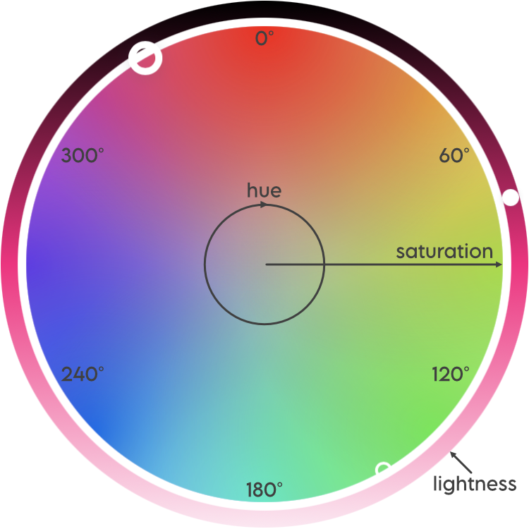
```

Colour theory determines which colours 'look good' together, based on their relative position on a colour wheel, somewhat analogously, I think, to how certain musical intervals sound more pleasing/harmonious than others, depending on the ratio of their frequencies. As shown in Figure \@ref(fig:colour-harmonies), there are various different types of colour palettes that are in colour harmony, such as complementary (comprised of colours opposite each other on the wheel), analagous (three colours side by side) and triadic (three colours evenly spaced around the wheel). Note that all the colour schemes are derived from the same twelve colours, spaced evenly around a circle. 

```{r colour-harmonies, echo = FALSE, fig.cap = "Harmonious colour combinations. Figure from [https://www.widewalls.ch/magazine/color-theory-basics-elements-color-wheel](https://www.widewalls.ch/magazine/color-theory-basics-elements-color-wheel) SAY MORE. ADD ALT TEXT"}
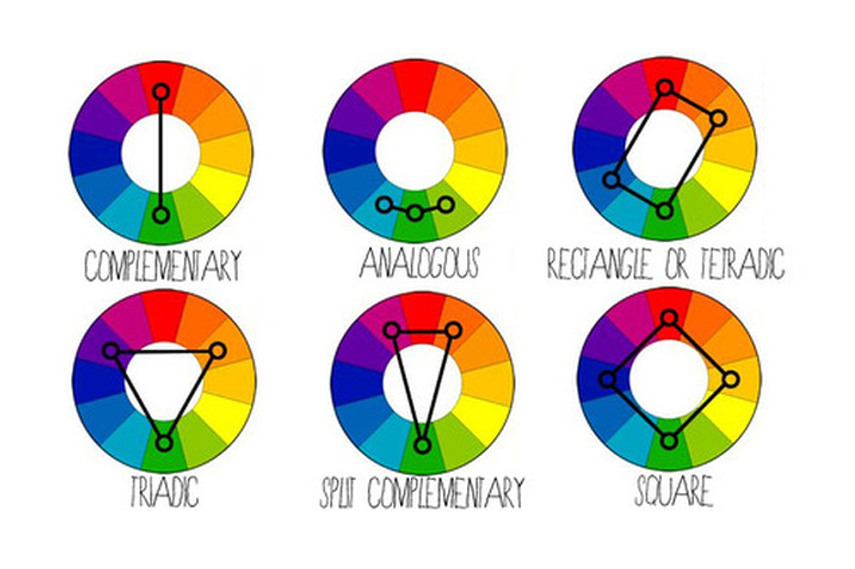
```

Another aspect of colour theory relates to colour spaces, and different ways that colours can be defined. The best known, at least in the context of designing for the web, is RGB (**R**eg **G**reen **B**lue), which defines a colour by how much of each of those three primary colours it contains, in a range of 0-255. It is the hexidecimal representations of these three numbers that combine to make up the hex code for a colour.

More intuitive, however, for adjusting colours, is defining them by HSB (**H**ue, **S**aturation, **B**rightness), also known as HSV (**H**ue, **S**aturation, **V**alue). Similar to HSB is HSL (**H**ue, **S**aturation, **L**ightness). 

In HSB, the hue represents the colour type and is a number measured between 0 and 360°; it's where you are on the colour wheel, ignoring how bright or intense the colour is. Saturation describes the intensity or richness of the hue, measured between 0 and 100%. 100% is the richest version of the colour and 0% is a shade of grey. Brightness measures, you guessed it, the brightness of the colour. Again, it ranges from 0 to 100%, with 0% being black and 100% being a very bright colour (here, black is not the opposite of white). Here's a [excellent article on the HSB system](https://learnui.design/blog/the-hsb-color-system-practicioners-primer.html), which also explains how it differs from HSL. And since a picture here is worth very many words, see Figure \@ref(fig:hsl-hsb-sliders) for HSL and HSB sliders for my pink.

```{r hsl-hsb-sliders, echo = FALSE, fig.cap="HSL and HSB sliders for the pink used throughout this site. Image is a screenshot from [http://colorizer.org](http://colorizer.org). ADD ALT TEXT"}
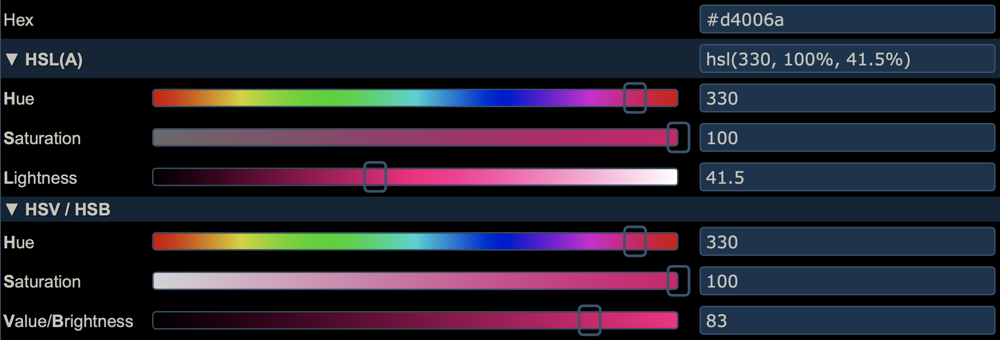
```

There is an R package for working with colour spaces, the intuitively named [{colorspace}](https://colorspace.r-forge.r-project.org/articles/colorspace.html). The main colour space they work with is HCL, (**H**ue, **C**hroma, **L**uminance), but, somewhat confusingly, that is different, once again, from both HSL and HSB. The HCL colour space is designed to provide a more perceptually uniform colour space than either HSB or HSL. A [vignette](https://colorspace.r-forge.r-project.org/articles/color_spaces.html) provides more details. Outside of the package, I haven't seen it used elsewhere, at least not in the myriad of sites on colour theory for designers or colour/design apps than I use or have read when preparing my theme and this post. In any case, percentual uniformity is arguably more important in choosing colour palettes for data visualisation, where the colour conveys information about the data, than in picking a few colours that look good together for a syntax highlighting scheme. Still, I mention it here because I do sometimes use {colorspace} for creating palettes for data visualisation (the package provides {ggplot2} scales) and, until I dug into it when writing this post, I didn't appreciate the difference between that space and others.

It's great to play around with an HSL or HSB colour wheel to get a sense of how harmonious colour schemes are built, and how the colours in them relate to each other on the wheel. I really like the [canva colour wheel](https://www.canva.com/colors/color-wheel/). It's pretty simple, with only a few schemes, but it's nicely designed and easy to use, and the page explains the basics of colour theory too. I like how you can pull the dots around the wheel and see how the colours relate, and if you click on a colour in the palette, there are HSL sliders too. Plus, as you move colours around, the background of the page changes colour, which is a nice touch! 

## Approach 1

### Building a palette based on <span style="color:#D4006A">my pink</span>, using colour theory

The problem with all the colour schemes defined in Figure \@ref(fig:colour-harmonies) is that they use a maximum of four colours, and we need five. But not to worry! We know from colour theory that we can find 12 colours in harmony by taking evenly spaced colours around the HSL or HSB wheel, i.e. colours whose hues are 30° apart, given fixed values for saturation and brightness/lightness. Since we only need five colours, it's sufficient to find the six colours that are 60° apart, and ignore one of them. Note that for five colours to appear harmonious, we have to respect these angles, not choose five colours that are 72° apart.

The main pink that I use in this site has hex `r bg_col("#D4006A")`. In ColorSlurp, I started a new palette with that as a starting point, then switched to the HSB sliders, and found its HSB values are 330°, 100%, 83%. Leaving the S and B sliders where they are, the next colour I need is 60° around the circle, i.e. at 30°, so I moved the H slider to that value and added the resulting orange to the palette. I then repeated for 90°, 150°, 210° and 270°, giving me two shades of green, a blue and a purple. As I only need five colours, I discarded one of the greens, keeping the one at 150°, which is complementary to my main pink. If you don't use ColorSlurp or a similar app, there are many online options for building a palette in this way, for example [http://colorizer.org](http://colorizer.org) (add a new color to the palette by clicking on the next square down to the right of the sliders). In both ColorSlurp and on colorizer.org, once you have defined a colour by its HSB values, you can read off the hex code. 

At the end of this stage of the process, based purely on colour theory, my syntax highlighting colour scheme now stood as in Figure \@ref(fig:colour-theory-palette). In the HSB space, these colours all have a saturation of 100% and a brightness of 83%.

```{r colour-theory-palette, echo = FALSE, fig.cap = "Colours for syntax highlighting, starting from my main pink, based only on colour theory"}
library(colorspace)
#ek_pure_highlight_colours <- c("#D4006A", "#D46A00", "#00D46A", "#006AD4", "#6A00D4")
#swatchplot(ek_pure_highlight_colours, border = "transparent")
# Using the above code gives too much white around the swatches, so I ran the code, took a screen shot to crop it, then include that image back in.
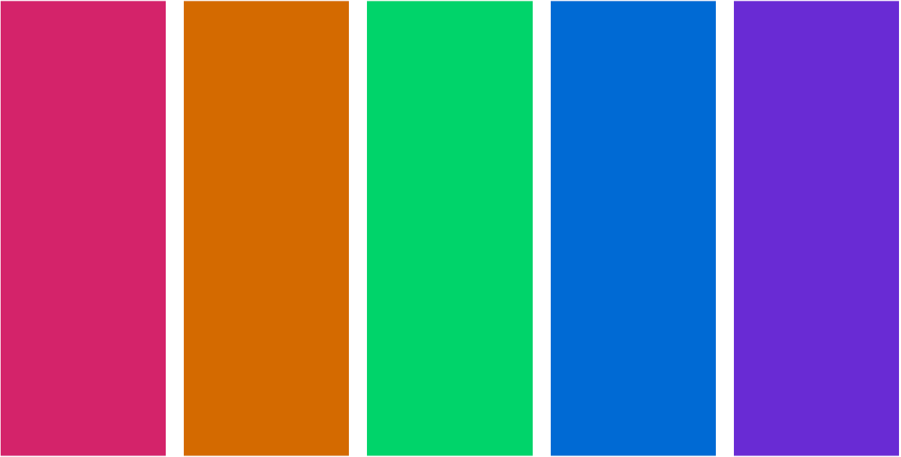
```

### Adapting for web accessibility

As noted at the beginning of this post, one key feature of the default syntax highlighting scheme for {distill} is that it is optimised for accessibility and colour contrast. According to the [Web Content Accessibility Guidelines](https://www.w3.org/WAI/standards-guidelines/wcag/), at the WCAG AA (minimum contrast) level, this requires that that contrast ratio between text and background colours be at least 4.5:1 for text of 14pt+ (which is the default text size for code in {distill}). The more stringent WCAG AAA (enhanced) level requires a ratio of at least 7:1.

The pro version of ColorSlurp includes a contrast checker, as in Figure \@ref(fig:colorslurp-contrast), though there are many websites that also offer this. The WebAIM (Web with Accessibility in Mind), has a very handy [contrast checker](https://webaim.org/resources/contrastchecker/) which, like ColorSlurp, also includes lightness sliders for adjusting the colours until the desired contrast is reached. Darkening a colour to improve contrast keeps the hue and saturation the same but reduces the brightness or lightness component (ColorSlurp uses HSB, WebAIM uses HSL).

```{r colorslurp-contrast, echo = FALSE, fig.cap = "Contrast checking in ColorSlurp"}
knitr::include_graphics("contrast-check.png")
```

The `r bg_col("#D4006A", "pink")`, `r bg_col("#006AD4", "blue")` and `r bg_col("#6A00D4", "purple")` in the palette created above have a contrast ratio of better than 4.5:1 with the pure white background, but the `r bg_col("#D46A00", "orange")` and `r bg_col("#00D46A", "green")` do not.

My first thought was to keep the pink, blue and purple the same, and to just adjust the orange and green to the necessary point. In the HSB space, that gives the palette in Figure \@ref(fig:orange-green-less-bright). 

```{r orange-green-less-bright, echo  = FALSE, fig.cap= "Reducing brightness in just the orange and green to achieve desired contrasts."}
#ek_pure_highlight_colours_og <- c("#D4006A", "#B65B00", "#008643", "#006AD4", "#6A00D4")
#swatchplot(ek_pure_highlight_colours_og, border = "transparent")
# Using the above code gives too much white around the swatches, so I ran the code, took a screen shot to crop it, then include that image back in.
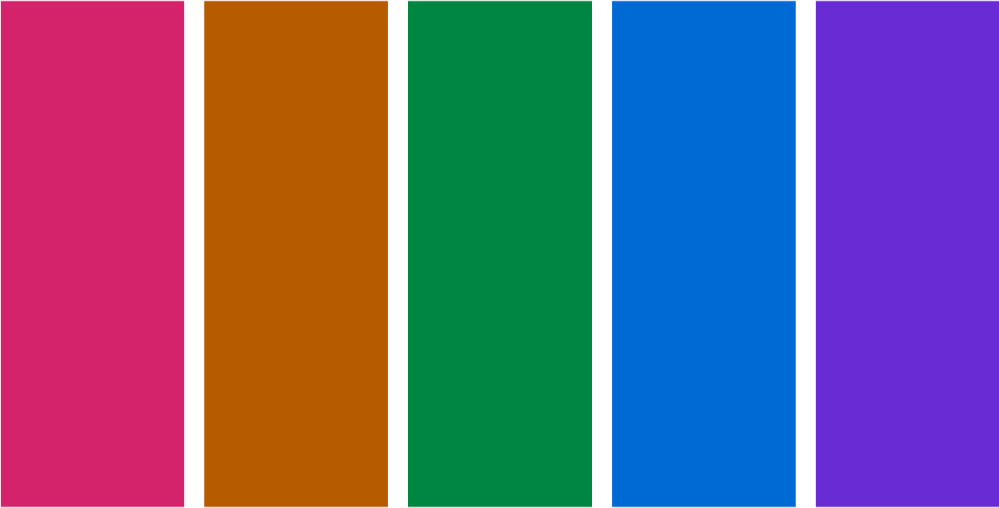
```

It's not bad, but when I applied that palette as a syntax highlighting scheme, to my eye the pink, blue and purple looked a little too bright relative to the orange.

My next thought was to darken all the colours to all share the brighness level of the least bright colour that passes the accessibility check (the green, at 53%). That gives the palette in Figure \@ref(fig:all-less-bright).

```{r all-less-bright, echo  = FALSE, fig.cap= "Reducing brightness in all colours to the level of the green."}
#ek_darker_highlight_colours <- c("#860043", "#884400", "#008643", "#004489", "#440088")
#swatchplot(ek_darker_highlight_colours, border = "transparent")
# Using the above code gives too much white around the swatches, so I ran the code, took a screen shot to crop it, then include that image back in.
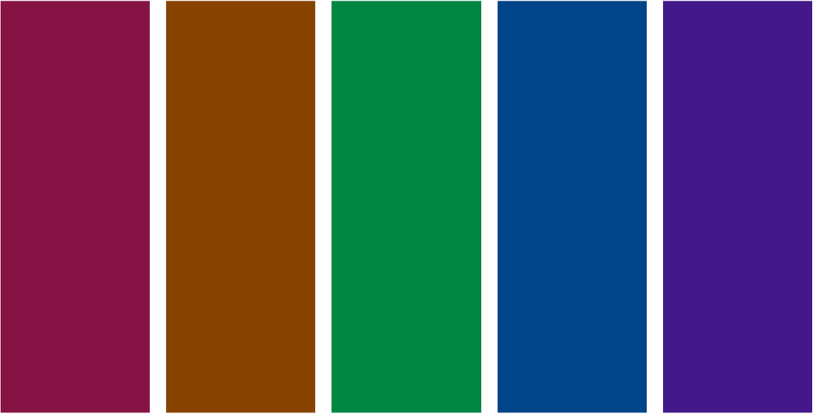
```

I don't like that at all! It's not vibrant enough, and, although the colours all have good contrast against the white background, they don't have much contrast with each other.

So, I settled on a compromise position. I reduced the brightness of the original pink, blue and purple to match the brightness of the accessibility-passing orange (71%), leaving only the green at a brightness of 53%, which it needs to pass the contrast check. That gives the palette in Figure \@ref(fig:final-palette).

```{r final-palette, echo = FALSE, fig.cap = "The palette I settled on for my syntax highlighting scheme."}
ek_highlight_colours <- c("#5A00B5", "#005BB6", "#008643", "#B65B00", "#B6005B")
#swatchplot(rev(ek_highlight_colours), border = "transparent")
# Using the above code gives too much white around the swatches, so I ran the code, took a screen shot to crop it, then include that image back in.
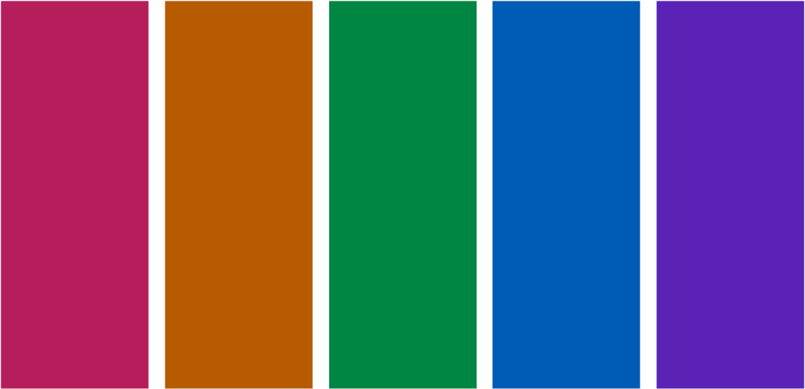
```

```{r eval = FALSE, echo = FALSE, fig.width = 7, fig.asp = 0.7}
library(scales)
scales::show_col(rev(ek_highlight_colours), ncol = 5, borders = "white", labels = FALSE) 
```

```{r eval = FALSE}
library(prismatic)
color(ek_highlight_colours) %>% plot()
```

I'm happy with that, and that's the syntax highlighting scheme I've adopted throughout this site, despite the fact that the palette now doesn't actually include the pink that I set out to build my scheme around! However, because of the process I've followed, the pink that is in the palette does tones well with the brighter pink and I think my site still has a consistent look. In the end, it was more important that all the colours in the palette looked consistent together and met accessibility guidelines. 

I am only just beginning to learn about web accessibility, and I know my site does not yet meet all best practices, but I'm committed to improving in this area. I first became aware of the issue of web accessibility because I follow [Silvia Canelón on twitter](https://twitter.com/spcanelon) and I highly recommend you do the same! The [a11y project](https://www.a11yproject.com) and [WebAIM](https://webaim.org) are great places to learn more. 

### Checking for colourblindness

Some visual impairments require a high colour contrast between text and background colour in order to be able to read content on the web. Another class of visual impairment worth paying attention to when designing palettes in that of colour blindness. (The WCAG note that all users should be able to access information that is conveyed by colour differences).

[Nick Tierney](https://www.njtierney.com) has some excellent resources about colour and colourblindness and R packages for accessing these. [These comprehensive slides](https://njt-monash-colour.netlify.app/#1) cover what colour is and how we perceive it, colourblindness, how to check how palettes/plots appear to those with different types of colourblindness, the HCL space, the {colorspace} package and how to create your own palettes. He also has a [short blog post](https://www.njtierney.com/post/2020/10/15/assess-colour/) on quickly assessing colour palettes to ensure they're colourblind-friendly.

As recommended in the above posts, I use the [{prismatic}](https://emilhvitfeldt.github.io/prismatic/) package by [Emil Hvitfeldt](https://www.hvitfeldt.me) to check how my syntax highlighting palette appears to those with different types of colourblindness:

```{r eval = FALSE}
library(prismatic)
ek_highlight_colours <- c("#5A00B5", "#005BB6", "#008643", "#B65B00", "#B6005B")
check_color_blindness(ek_highlight_colours)
```

```{r check-colourblindness, echo = FALSE, fig.cap="Checking my palette for how it appears to those with various types of colourblindness. ALT TEXT."}
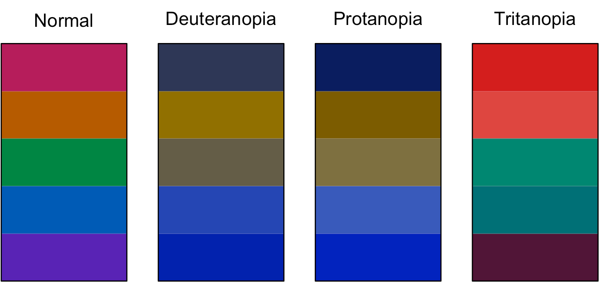
```

Thankfully, for all three main types of colourblindess, the five colours in the palette are distinguishable, so no further adjustments are necessary.

## An R-based alternative

The above sections describe the processes, both thought and practical, that I went through to derive the colour palette for my syntax highlighting scheme, and I'm happy with what I came up with. That said, as I've been writing up this blog post, I've become increasingly curious about alternative approaches I might have taken. In particular, could I have come up with a scheme that met my criteria entirely in R? Given the incredible ecosystem that R is, it should be no surprise that the answer turned out to be yes! So, below describes this alternative approach, using the [{colorspace}](https://colorspace.r-forge.r-project.org), [{coloratio}](https://matt-dray.github.io/coloratio/) and [{prismatic}](https://emilhvitfeldt.github.io/prismatic/) packages. Whereas the previous approach is based on the HSB colour space, this one uses HCL.

### Building a palette based on <span style="color:#D4006A">my pink</span>, using colour theory

The {colorspace} package uses the HCL color space, so the first task is to convert a hex code into its hue, chroma and luminance components, and make them available for future use, which can be done as follows:

```{r}
library(colorspace)
pink <- hex2RGB("#D4006A", gamma = FALSE)
pink_hcl <- as(pink, "polarLUV")

pink_h <- pink_hcl@coords[1, "H"]
pink_c <- pink_hcl@coords[1, "C"]
pink_l <- pink_hcl@coords[1, "L"]
```

The function from {colorspace} that is going to do the hard work of building a palette with differing hues but constant chroma and luminance is [`qualitative_hcl()`](https://colorspace.r-forge.r-project.org/reference/hcl_palettes.html). By default, you give it the number of colours you want, and it works out equally spaced hues, starting at 0°. To override this default, you can give the `h` argument a start and end value, `c(start, end)`. Again, I'm going to choose six colours, 60° apart, and discard one of them.^[Again, I want to stress that this 60° apart approach and discard one is NOT something I'd do when building a five-colour palette for a data visualisation. There, where the colours mean something in relation to the data, it's important that the hues are evenly spaced. Even for qualitative cases, such as stacked bar charts, where the colours don't mean anything, evenly spaced will be more visually appealing, as the colours are one-on-top of each other, as opposed to in a syntax highlighting scheme, where any of the colours can appear next to any of the others, so we want all pairs to look good together.] The `start` value should be in [0, 60) and the end value should be in [300, 360). Let the hue of our starting pink be `pink_h`. Then all the colours in the palette are going to have a hue `pink_h + 60 * k`  for some integer k. The following code picks the start and end values we need to pass to `h`:


```{r}
seq_60 <- seq(from = -300, to = 300, by = 60)
pink_60 <- seq_60 + pink_h

pink_h_lower <- pink_60[which((pink_60 >= 0 & pink_60 < 60))]
pink_h_upper <- pink_60[which((pink_60 >= 300 & pink_60 < 360))]
```

That's most of the hard work. Now we build the palette:

```{r}
hcl_six <- qualitative_hcl(
  6, 
  h = c(pink_h_lower, pink_h_upper), 
  c = pink_c, 
  l = pink_l
) 
#swatchplot(hcl_six, border = "transparent")
```

```{r hcl-six, fig.cap = "Six colours, with hues 60° apart and constant chroma and luminance, based around my pink."}
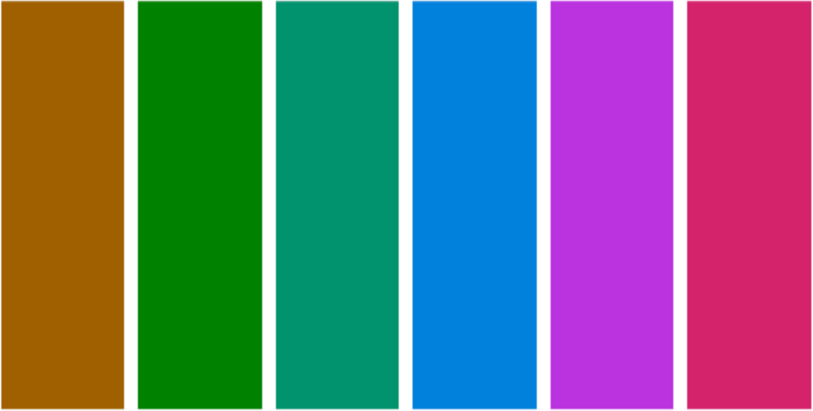
```

The only personal decision I make in this section is which of these six colours to discard. Removing the first of the greens gives me the palette in Figure \@ref(fig:hcl-five).

```{r hcl-five, fig.cap="As in the previous figure but minus a green and rearranged", echo = FALSE}
hcl_five <- hcl_six[c(6, 1, 3:5)]
#swatchplot(hcl_five, border = "transparent")
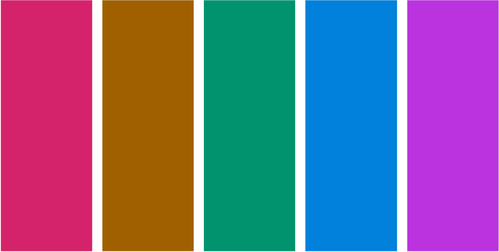
```

```{r eval = FALSE, echo = FALSE}
seq_72 <- seq(from = -288, to = 288, by = 72)
pink_72 <- seq_72 + pink_h

pink_72_h_lower <- pink_72[which((pink_72 >= 0 & pink_72 < 72))]
pink_72_h_upper <- pink_72[which((pink_72 >= 288 & pink_72 < 360))]

hcl_even_five <- qualitative_hcl(
  5, 
  h = c(pink_72_h_lower, pink_72_h_upper), 
  c = pink_c, 
  l = pink_l
) 
swatchplot(hcl_even_five, border = "transparent")
```


### Adapting for web accessibility

When I was developing my scheme, I used my trusted ColorSlurp app to adjust colours to ensure they met WCAG standards of web accessibility. In writing up this post, I since learnt about web resources to do the same (e.g. [WebAIM contrast checker](https://webaim.org/resources/contrastchecker/)) and now, for this section, I've discovered the [{coloratio}](https://github.com/matt-dray/coloratio) and [{savonliquide}](https://github.com/feddelegrand7/savonliquide) packages that can do this in R.

<aside>
This is a beautiful thing about blogging. In the process of writing this post, I'm learning so much!
</aside>

Both packages have much to recommend them. {savonliquide} has the advantage of being on CRAN, and provides a toolbox that allows the user to implement accessibility-related concepts, including, but not limited to, contrast checking. {coloratio} is GitHub only, and only for contrast checking, but it has some additional functionality in that area above {savonliquide}, such as quick plotting of the colours in contrast, and a function, `cr_choose_bw()` that chooses which of black or white has the better contrast ratio with a user supplied colour (which, incidentally, I've used in this post to automatically choose the text colour when highlighting words with different background colours, e.g. `r bg_col("#D4006A")` vs `r bg_col("#00D46A")`).

I'm going to use the `cr_get_ratio` function from `coloratio` to check the colour contrasts of each color in the palette. Because it's not vectorised, I use this in conjection with `map2_dbl` from [{purrr}](https://purrr.tidyverse.org) to get all the contrasts at once.

If any of the contrasts are less than 4.5, I then call on the `darken()` function from {colorspace}, which adjusts each colour in the palette to make it, you guessed it, a bit darker, therefore improving the contrast ratio. I loop over these checking and darkening iterations until all colours in the palette are sufficiently accessible. Here the code that achieves this:

```{r message=FALSE, warning = FALSE}
library(coloratio)
library(purrr)

palette <- hcl_six[c(6, 1, 3:5)]
contrasts <- map2_dbl(palette, "white", ~cr_get_ratio(.x, .y, quiet = TRUE))
min_contrast <- 4.5
any_too_light <- any(contrasts < min_contrast)

while (any_too_light) {
  palette <- darken(palette, amount = 0.05)
  contrasts <- map2_dbl(palette, "white", ~cr_get_ratio(.x, .y, quiet = TRUE))
  any_too_light <- any(contrasts < min_contrast)
}
```

At the end of the process, the palette looks like this:

```{r hcl-darkened, fig.cap="An HCL palette where all colours have a contrast ratio of 4.5:1 or better against white", echo = FALSE}
#swatchplot(palette, border = "transparent")
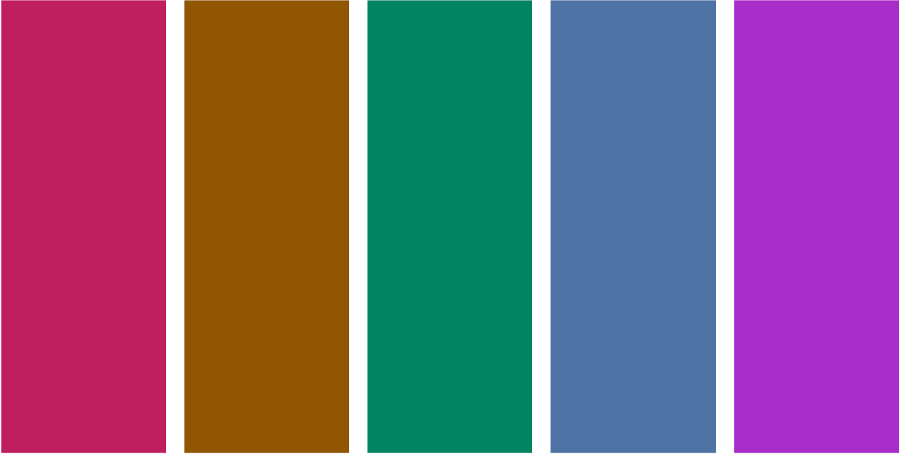
```

### Checking for colourblindness

As before, we use {prismatic} to check how the palette appears to those with various types of colourblindess. Whilst R can help us visualise this, we still need to use our judgement as to whether the output is acceptable. I believe, in Figure \@ref(fig:hcl-darkened-colourblind), it is.

```{r hcl-darkened-colourblind, echo = FALSE, fig.cap="Checking how the darkened HCL palette appears to those with various types of colourblindness."}
#library(prismatic)
#check_color_blindness(palette)
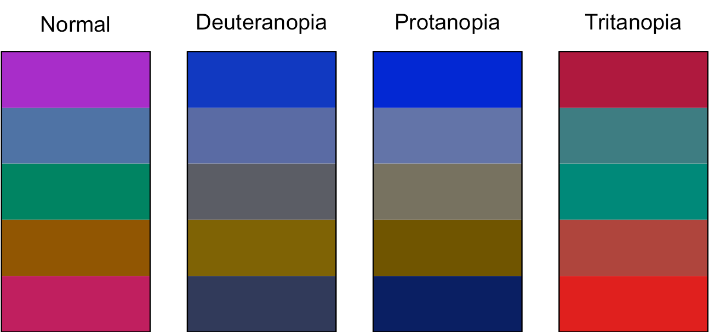
```

### But, do I like it?

Going through the process of building a colour palette that meets my criteria purely in R, in as automated, reproducible and adaptable way as possible has been a great learning experience for me, and hopefully something that will be useful to others. I don't much like the palette it produced, though, especially in comparison to the one I came up with previously! Although the HCL-based palette probably has slightly better theoretical perceptual qualities, I prefer the vibrancy of the colours in the one I came up with before, and that's the one I've adopted on this site. 

## Back to Part 1


